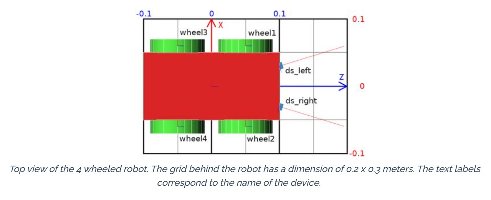
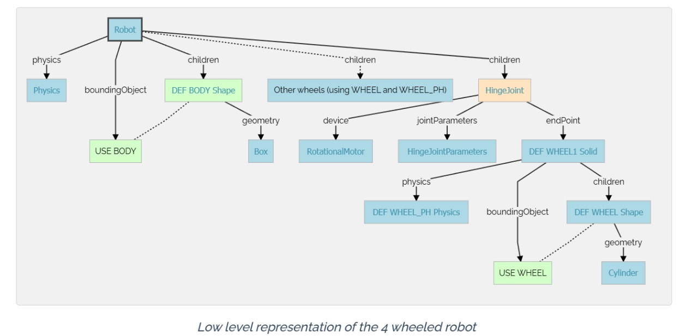
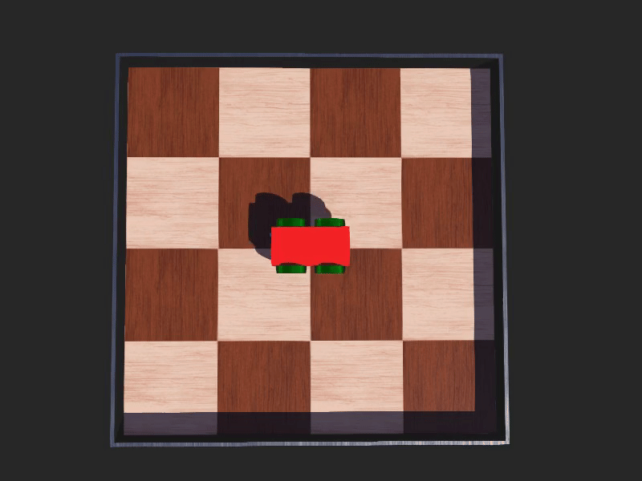

# 4-Wheeled Robot in Webots

This project implements a simple 4-wheeled differential drive robot in [Webots](https://cyberbotics.com/), using Python as the controller language. The robot uses two distance sensors to detect obstacles and performs basic avoidance behavior.

## Robot Overview

### Simulated View


### Schematic Representation


### Demo Animation


## Behavior Description

- The robot uses two distance sensors (`ds_right` and `ds_left`) to monitor obstacles.
- When an obstacle is detected by either sensor (value < 950), the robot initiates a turn by reversing one set of wheels for a few steps.
- Otherwise, it moves forward continuously.

## Controller Code Summary

```python
from controller import Robot

TIME_STEP = 64
robot = Robot()

# Enable distance sensors
ds = [robot.getDevice(name) for name in ['ds_right', 'ds_left']]
for sensor in ds:
    sensor.enable(TIME_STEP)

# Initialize wheels
wheels = [robot.getDevice(name) for name in ['wheel1', 'wheel2', 'wheel3', 'wheel4']]
for wheel in wheels:
    wheel.setPosition(float('inf'))
    wheel.setVelocity(0.0)

avoidObstacleCounter = 0

while robot.step(TIME_STEP) != -1:
    leftSpeed = 1.0
    rightSpeed = 1.0
    if avoidObstacleCounter > 0:
        avoidObstacleCounter -= 1
        leftSpeed = 1.0
        rightSpeed = -1.0
    else:
        for sensor in ds:
            if sensor.getValue() < 950.0:
                avoidObstacleCounter = 100
    # Apply velocities
    wheels[0].setVelocity(leftSpeed)
    wheels[1].setVelocity(rightSpeed)
    wheels[2].setVelocity(leftSpeed)
    wheels[3].setVelocity(rightSpeed)
